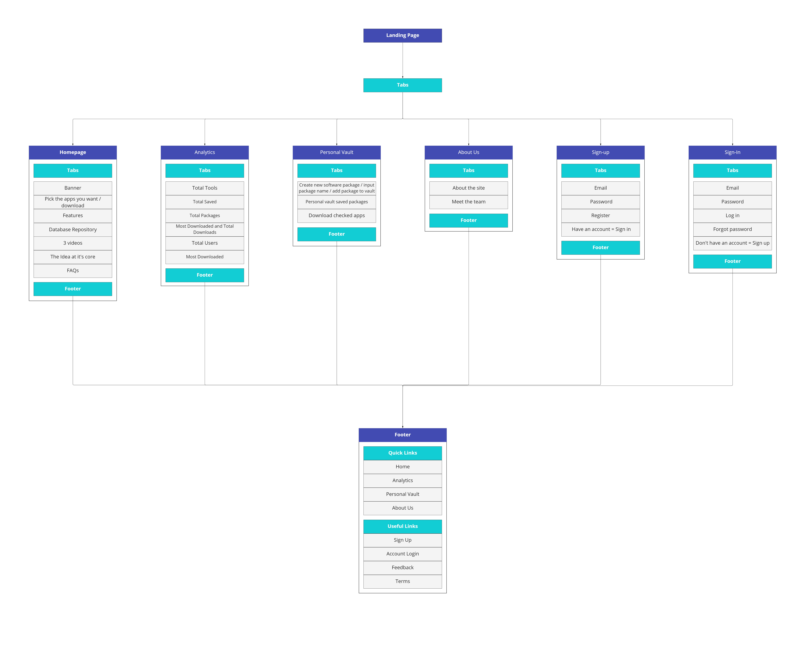

# Fullstack-Devlopment

# Inrtrodcution
The Kick Start Software project aims to provide users with a one-stop destination for downloading multiple software programs and utilities. The project will feature a frontend, backend, and database, creating a comprehensive technology stack that will improve user experience and streamline the process of downloading software.

# The problem
Currently, users often have to waste time downloading multiple software programs and visiting multiple websites to obtain the utilities they need. This can be a time-consuming and frustrating process, especially for users who need to download a large number of programs.

# The solution
The Kick Start Software project aims to solve this problem by providing users with a single website where they can download multiple software programs with just a few clicks. The website will also feature a personal vault where users can save their frequently used software for easy access, as well as a community analytics section that will provide valuable data on the most popular software among users.

# Key Features
* Single website for downloading multiple software programs
* Personal vault for saving frequently used software
* Community analytics section for data on popular software

# Prototype:
The prototype for the Kick Start Software project will be limited in scope, and may only include demo data. However, this should not be considered a limitation, as the prototype will provide a valuable proof of concept for the project.

# Group Members
* [@Nero-DevOps](https://github.com/Nero-DevOps) (Owner)
)

# Conclusion
The Kick Start Software project is a valuable solution to the problem of downloading multiple software programs and utilities. The project's technology stack, personal vault, and community analytics features will improve user experience and provide valuable data on the most popular software among users. The prototype will provide a proof of concept for the project, and its success will pave the way for further development.
